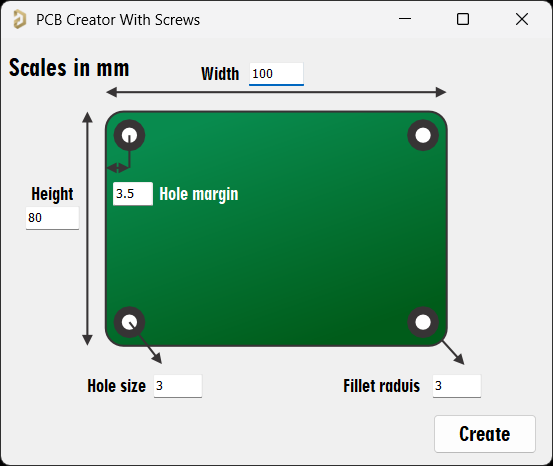
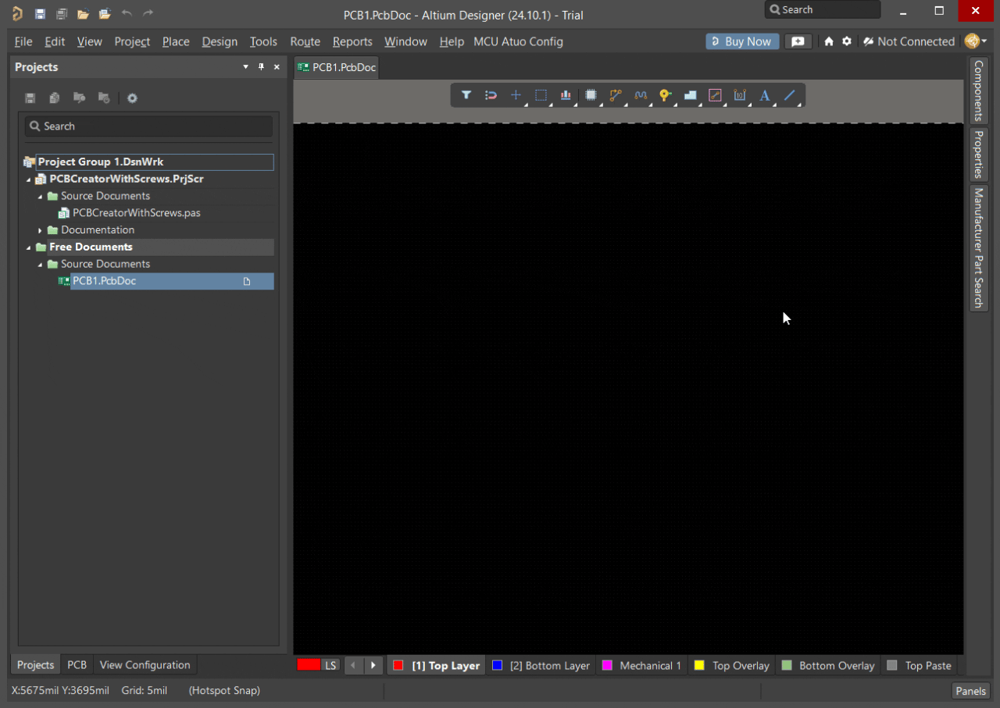
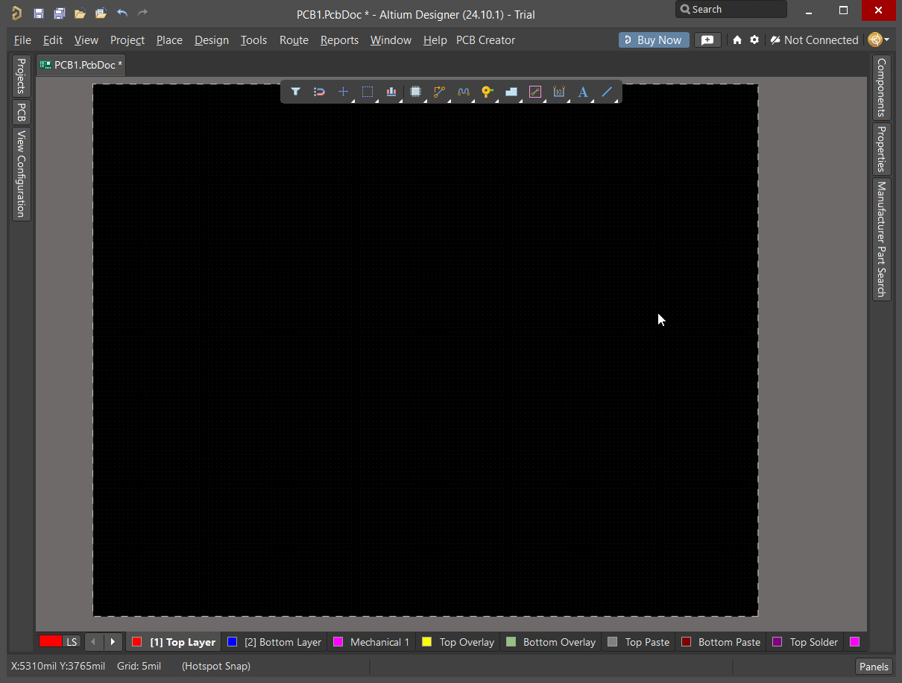

# PCB Creator Script for Altium Designer



This script provides a GUI interface in Altium Designer to quickly create custom PCB outlines with mounting holes and design rules.

## Features

- 🛠️ **Custom PCB Outline Creation**
  - Rectangular boards with configurable dimensions
  - Optional rounded corners (fillet radius)
- 🔩 **Automatic Mounting Holes**
  - Four corner holes with decorative elements
  - Customizable hole size and margin
- 🎨 **Visual Enhancements**
  - Decorative arcs on multiple layers
  - Clear silkscreen markings

## Installation

1. **Running the Script**:
   - In Altium Designer, go to:
     ```
     File → Run Script...
     ```
   - Select the Downloaded Script

## Toolbar Shortcut (Optional)

   - Keep PCBCreatorWithScrews.PrjScr file & open in Altium Project
   - Open a new PcbDoc file right-click on Toolbar and select Customize...
   - In [Scripts] drag `PCBCreatorWithScrews.pas` into the toolbar and choose a caption for it.




## Usage

1. **Input Parameters**:
   | Parameter        | Description                          | Example Value |
   |------------------|--------------------------------------|---------------|
   | Width            | Total board width in mm              | 100.0         |
   | Height           | Total board height in mm             | 80.0          |
   | Fillet Radius    | Corner rounding radius (0 for sharp) | 5.0           |
   | Hole Size        | Diameter of mounting holes in mm     | 3.2           |
   | Hole Margin      | Distance from board edge to holes    | 5.0           |

2. **Output**:
   - Creates board with desired size and corner radius
   - Adds 4 decorative mounting holes
  ### Note:
  For manufacturing the board you have to define keep-out board of your PCB.
  
  Go to:
     ```
     Design → Baord Shape → Create Primitives From Board Shape
     ```
 then choose Keep-Out Layer
  
3. **Visual Example**:


## Example Output

```text
Created PCB with:
- Dimensions: 100mm × 80mm
- Fillet radius: 5mm
- 4 mounting holes (3.2mm) with 5mm margin
- Automatic width rules (0.2mm min, 2mm max)
